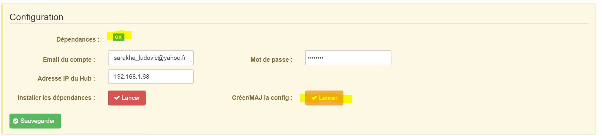

==== Harmony Hub Plugin Konfiguration :

.. Installation/Einrichtung

Um das Plugin zu benutzen, müssen sie es herunterladen, installieren und aktivieren wie jedes andere Jeedom Plugin.  

Suite à cela il vous faudra lancer l'installation des dépendances :

{nbsp} +

image:../images/dep_harmony.jpg[width=756]

{nbsp} +

Suite à cela il vous faudra lancer la création de votre premier fichier de config (à faire pour prendre en compte un éventuel rajout d'activité ou dispositif) :

{nbsp} +

{nbsp} +