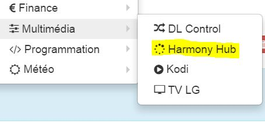
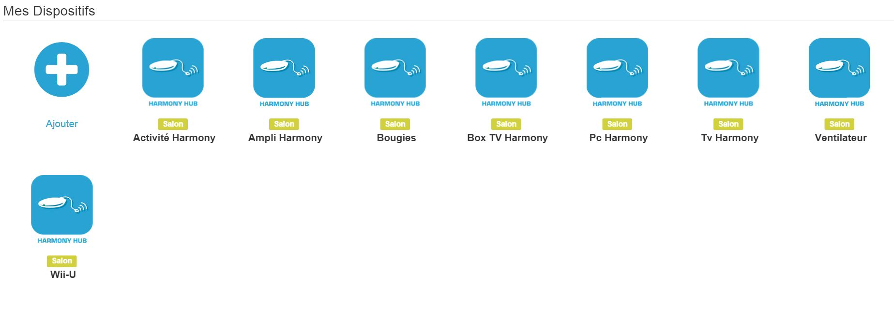
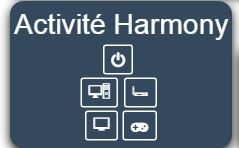
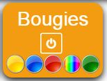

==== Vos dispositifs/Activités :

.. Création

Afin de créer vos premiers équipemments, il faut vous rendre dans le menu plugin:

{nbsp} +

{nbsp} +

Ensuite cliquez sur le bouton "+" pour rajouter un équipement :

{nbsp} +

{nbsp} +

Vous arriverez sur cette page :

{nbsp} +

image:../images/harmonyhub_screenshot3.jpg[width=756]

{nbsp} +

Dans cette page vous pouvez attribuer un objet, activer et/ou rendre visible votre équipement.

Le menu déroulant vous permet de choisir parmis :

* Activités : Un équipement regroupant toutes vos activités ainsi que le power off général. Et une info de l'activité en cours.

* Un de vos dispositifs : Un équipement regroupant toutes les commandes pour un dispositif donné.

Une fois choisit il vous suffit de cliquer sur sauver pour générer automatiquement la liste des commandes correspondantes.

{nbsp} +

image:../images/harmonyhub_screenshot4.jpg[width=756]

{nbsp} +

Par défaut, toutes les commandes sont en non affichées. Elles sont cependant toutes disponibles via scénario/ virtuel etc... Si vous voulez en afficher sur votre dashboard, il vous suffit de les réorganiser en glisser déposer de cliquer sur afficher. Vous pouvez ensuite en jouant avec les retours à la ligne, des widgets spécifiques ou les icones proposer vous créer votre simili télécommande.

{nbsp} +

{nbsp} +