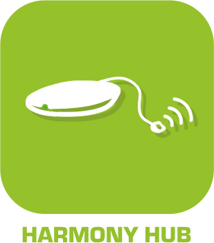

== Harmony Hub

=== Description
Ce plugin permet de controller et de récupérer tous les dispositifs de son Harmony Hub.

{nbsp} +

{nbsp} +

Ce plugin de récupérer vos activités et vos dispositifs. Et ensuite de pouvoir ajouter automatiquement toutes les commandes associées, pour pouvoir les controller via scénarios, virtuels, dashboard etc....

"
=== Configuration
include::configuration.asciidoc[]

...

=== Les équipements
include::informations.asciidoc[]

...

=== FAQ
include::FAQ.asciidoc[]

"