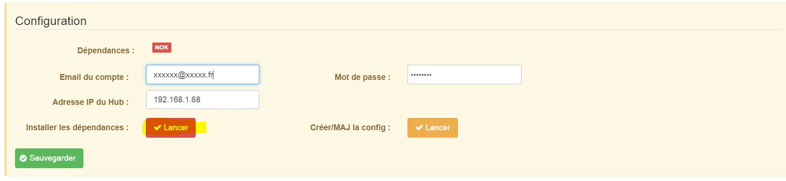
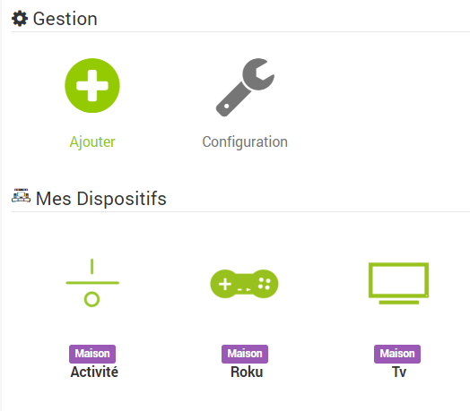
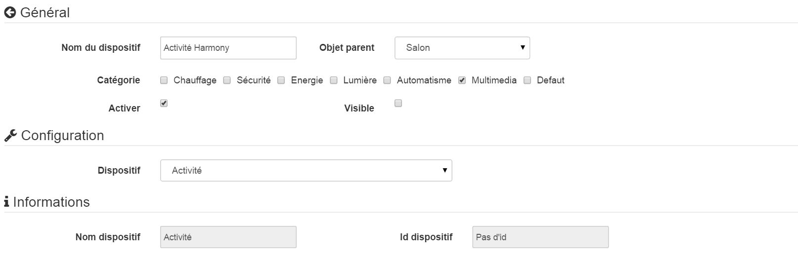
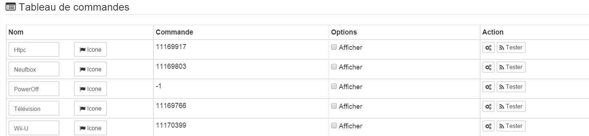
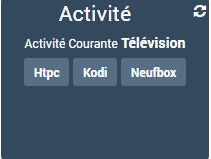

 
===========

Descrição 
-----------

.

. 

.

Configuração 
-------------

###  : 

.

 :

 :
 

 
---------------

###  : 

:

 :

 

 :

 

 

.

 :

-    : 
    . .

-    : 
    .

.

 

 

. 

. 

.

----------------------

 :

<https://community.logitech.com/s/question/0D55A00008OsX3CSAV/update-to-accessing-harmony-hubs-local-api-via-xmpp>
 
---

.
